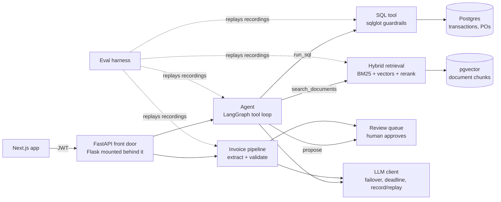

# Lumen: how the system works, and why

For the owner: the high-level picture you should be able to draw on a whiteboard and defend in an interview.
No code. Each part says **what it is**, **why it's built that way**, and **what to say about it**.
Status markers: ✅ built, 🔄 in progress, ⬜ planned. Source of truth for status: `PROGRESS.md`.

## The product in one sentence
An **accounts-payable copilot** for small finance teams. It reads invoices, checks them against purchase
orders and vendor history, sends anything suspicious to a human review queue, and answers spend questions
with cited evidence. The LLM reads, checks and proposes; a human approves anything that changes data.

## The big picture

Two kinds of data, two kinds of tools: **numbers live in SQL** (exact questions like "total spend last
quarter"), **text lives in the document index** (fuzzy questions like "what are the payment terms with
TechHub?"). The agent's main skill is choosing the right one, and that choice is measured.

---

## 1. The LLM client ✅ (`backend/llm/`)
- **What:** the only code that talks to a model. It knows three providers (OpenRouter, Groq, local
  Ollama), tries models in order when one fails (failover), and enforces a 100-second budget per request.
- **Why:** free models are slow, rate-limited and get retired without notice. We saw two of those three happen
  in one evening. One place to handle failure beats every feature handling it differently.
- **Record/replay ("cassettes"):** every reply can be saved to a file and replayed later, so tests and evals
  are free, offline and give identical results every run.
- **Say:** "LLM calls are infrastructure: one client with typed errors, failover, a request deadline and
  deterministic replay for evals."

## 2. The eval harness ✅/🔄 (`backend/evals/`)
- **What:** synthetic datasets with exact answers, suites that run the *real* pipeline on them, and a runner
  that compares each run with the last release, case by case.
- **Why first:** without a "before" number, "I improved the RAG" is an opinion. The baseline (EVAL-03) is the
  "before"; every later module reports an "after".
- **Key ideas to explain:**
  - *Labels by construction:* invoices are rendered from known data and facts are planted in known document
    sections, so the right answer is never a judgement call.
  - *Dev/test split:* we iterate on dev only; test is touched only at a release, so we can't overfit to it.
  - *Confidence intervals:* with 30 questions, "28/30" really means "somewhere between 79% and 98%". Showing
    the interval is the honest version.
  - *Paired regression gate:* CI fails if 2+ questions that used to pass now fail, and names them.
  - *Hard gates:* tenant leaks and followed injections must be exactly 0.
- **Say:** "I built the evals before the features, so every claim on my resume has a number, a dataset and a
  reproducible command behind it."

## 3. Text-to-SQL with guardrails ✅ (`backend/ai/sql_agent.py`)
- **What:** the model writes SQL; before it runs, `sqlglot` parses it, rejects anything that isn't a
  read-only SELECT on allowed tables, and wraps it so it can only see the asking user's rows.
- **Why:** never trust model-written SQL. Safety comes from the guardrail, not from the prompt.
- **Measured:** even a fake model that parrots everything can't leak another user's data. First real
  numbers: 28/30 correct rows, 20/30 with identical columns.
- **Weakness found by the evals:** the model guesses names ("electric") instead of looking them up, so it
  confidently answers ₹0. The agent's lookup tools fix that.

## 4. Hybrid RAG ⬜ (SPEC-RAG next)
- **What:** search over unstructured documents (PO PDFs, contracts, policies, invoice text). Steps:
  1. **Chunk** documents along their sections, keeping the section id.
  2. **BM25** keyword search: finds exact terms like "PO-U1-202605-06" that vector search misses.
  3. **Dense** vector search (local `bge-small` embeddings in pgvector): finds meaning, like "when is payment
     due" matching "Net 30".
  4. **RRF (reciprocal rank fusion):** merges both ranked lists without having to tune score scales.
  5. **Rerank:** a small cross-encoder rereads the top candidates against the question and reorders them.
  6. **Every chunk is filtered by user**, the same tenant rule as SQL.
- **Why hybrid:** each method fails differently, and fusion is cheap. We'll *prove* each step helps with an
  ablation table (dense → + BM25/RRF → + rerank), measured as recall@5 and nDCG@10.
- **Why hand-built instead of a framework:** this is the part an interviewer asks about; it should be ours.
- **Say:** "Hybrid retrieval with RRF and reranking, tenant-filtered, with an ablation showing what each stage
  adds."

## 5. The agent ⬜ (SPEC-AGENT)
- **What:** instead of a fixed pipeline, the model gets typed tools (`get_schema`, `run_sql`,
  `search_documents`, `get_anomalies`, `forecast`, `get_invoice`) and decides which to call, in a bounded
  loop (LangGraph). Answers cite their sources and show the tool steps.
- **Why:** questions like "why was INV-1042 flagged and what did we pay this vendor last quarter?" need
  several tools in sequence. A fixed pipeline can't do that.
- **Autonomy boundary:** the agent is read-only. It can *propose* actions (typed object, risk level,
  evidence), which pause the graph until a human approves. Every proposal and decision is audit-logged.
- **Measured:** tool-selection accuracy, abstention on unanswerable questions, and the safety gates.
- **Say:** "A bounded tool-calling agent with human-in-the-loop approval; autonomy is a policy setting, not a
  rewrite."

## 6. Invoice extraction and validation ⬜ (SPEC-EXTRACT)
- **What:** structured extraction (JSON schema plus validation) instead of "please reply in JSON"; then rules:
  totals vs line items, duplicates, vendor/PO match, date sanity; then a confidence score; then a review queue
  (extracted → flagged → approved/rejected).
- **Why:** an AP tool's value is catching the bad invoice, not reading the good one.
- **Measured:** field-level F1 on clean vs degraded scans, and whether each planted fault is caught.

## 7. Serving ✅ (`backend/asgi.py`)
- **What:** FastAPI is the front door; the old Flask app is mounted behind it, so nothing broke; new
  endpoints are FastAPI. One uvicorn worker fits Render's free 512 MB.
- **Why:** a "strangler" migration: replace the old system piece by piece instead of a risky rewrite. Parity
  tests prove auth, rate limits, CORS and error bodies behave the same on both sides.

## 8. Observability ⬜ (AGT-06)
- **What:** per-request traces: which tools ran, each LLM call's latency, tokens and cost.
- **Why:** you can't fix p95 latency or cost per question without seeing where the time and tokens go.

---

## How a question will flow (target)
1. The user asks; the API checks the JWT and the rate limit.
2. The agent sees the question plus tool descriptions and picks a tool, e.g. `search_documents`.
3. Retrieval runs (BM25 + vectors → RRF → rerank), filtered to this user.
4. The agent may call `run_sql` for the numbers; the guardrails validate and scope the query.
5. The agent writes the answer, citing chunk ids and showing the SQL. If it wants to change something, it
   files a proposal for a human instead.
6. The trace records every step, with latency and cost.

## Build order and why
`evals → LLM client → API front door → baseline → RAG → agent → extraction → UX`. Measure first, then build
the part with the clearest before/after (retrieval), then the agent that uses it, then the AP workflow, then
polish. Cut-line if time runs out: finish the FastAPI port, then UX polish, then agent memory.
